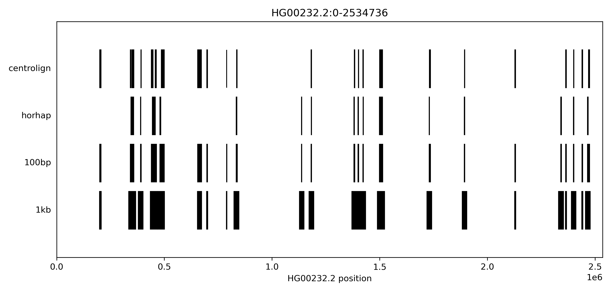

## This notebook looks at concordance between HorHap derived SVs and centrolign SVs

### 1. Comparison using percent overlap

Starting with chr 12 cenHap 4.

```sh
/private/groups/patenlab/mira/centrolign/analysis/SVs_pairwise/chr12/cenHap4_benchmarking_HorHaps
```
On local computer, plot cenhap 4 with respect to chr12 HOR tree - confirmed they are in subgroup 1
```sh
chromosomes=("chr12")

for chr in "${chromosomes[@]}"
do
  python3 /Users/miramastoras/Desktop/github_repos/centrolign_analysis/scripts/pairwise_tree_heatmap_v2.py \
    -t /Users/miramastoras/Desktop/HPRC_release2_QCv2_all_pairs_heatmaps/${chr}_r2_QC_v2_centrolign_all_pairs_nj_tree.format5.nwk \
    -s /Users/miramastoras/Desktop/HPRC_release2_QCv2_all_pairs_heatmaps/${chr}.samples.txt \
    -p /Users/miramastoras/Desktop/HPRC_release2_QCv2_all_pairs_heatmaps/${chr}_r2_QC_v2_centrolign_pairwise_distance.csv \
    -m "Centrolign all pairs distances" \
    -n "${chr} NJ tree" \
    -d "All pairs Distances" \
    -o /Users/miramastoras/Desktop/color_subgroups_heatmap/${chr}_r2_QC_v2_cenHap4_colored --no_labels \
    --highlight_samples /Users/miramastoras/Desktop/chr12_cenhap4_HPRC_sample_list.txt
done
```
Run SV calling script on cenhap 4 samples
```sh
#!/bin/bash
#SBATCH --job-name=SVs_chr12_cenhap4
#SBATCH --partition=short
#SBATCH --mail-user=mmastora@ucsc.edu
#SBATCH --mail-type=ALL
#SBATCH --nodes=1
#SBATCH --mem=50gb
#SBATCH --ntasks=1
#SBATCH --cpus-per-task=1
#SBATCH --output=logs/call_SVs_%x.%j.log
#SBATCH --time=1:00:00


mkdir -p /private/groups/patenlab/mira/centrolign/analysis/SVs_pairwise/chr12/cenHap4_benchmarking_HorHaps/SV_beds/

time python3 /private/groups/patenlab/mira/centrolign/github/centrolign_analysis/scripts/call_SVs_pairwise.py \
  -c /private/groups/patenlab/mira/centrolign/batch_submissions/centrolign/release2_QC_v2/MSA/chr12/subgroup_1/induced_pairwise_cigars/pairwise_cigar_ \
  -s /private/groups/patenlab/mira/centrolign/analysis/SVs_pairwise/chr12/cenHap4_benchmarking_HorHaps/chr12_cenhap4_HPRC_sample_list.txt \
  -o /private/groups/patenlab/mira/centrolign/analysis/SVs_pairwise/chr12/cenHap4_benchmarking_HorHaps/SV_beds/
```

Convert coordinates back to asm coords
```sh
time python3 /private/groups/patenlab/mira/centrolign/github/centrolign_analysis/scripts/convert_SV_bed_to_asm_coords.py \
  -s /private/groups/patenlab/mira/centrolign/analysis/SVs_pairwise/chr12/cenHap4_benchmarking_HorHaps/SV_beds/ \
  -a /private/groups/patenlab/mira/centrolign/batch_submissions/centrolign/release2_QC_v2/per_smp_asat_beds/ \
  -c chr12 \
  -o /private/groups/patenlab/mira/centrolign/analysis/SVs_pairwise/chr12/cenHap4_benchmarking_HorHaps/SV_beds_asm_coords/
```

Comparing percent overlap with Fedor's SVs.


Ran this python notebook to convert bed files into comparable format: https://github.com/miramastoras/centrolign_analysis/blob/main/analysis_notes/release2_QC_v2/notebooks/SVs_pairwise.ipynb

```sh
# report all centrolign SVs and their percent overlap with horhap SVs
bedtools intersect \
    -a /private/groups/patenlab/mira/centrolign/analysis/SVs_pairwise/chr12/cenHap4_benchmarking_HorHaps/centrolign_SVs_ins.bed \
    -b /private/groups/patenlab/mira/centrolign/analysis/SVs_pairwise/chr12/cenHap4_benchmarking_HorHaps/horhap_SVs_ins.bed \
    -wao | awk '{pct = ($NF / ($3 - $2)) * 100; print $0 "\t" pct}'


# Calculate percent of centrolign features overlapped by HorHap features - ins

bedtools sort -i /private/groups/patenlab/mira/centrolign/analysis/SVs_pairwise/chr12/cenHap4_benchmarking_HorHaps/horhap_SVs_ins.bed | bedtools merge -i - > /private/groups/patenlab/mira/centrolign/analysis/SVs_pairwise/chr12/cenHap4_benchmarking_HorHaps/horhap_SVs_ins.merged.bed

bedtools coverage \
    -a /private/groups/patenlab/mira/centrolign/analysis/SVs_pairwise/chr12/cenHap4_benchmarking_HorHaps/centrolign_SVs_ins.bed \
    -b /private/groups/patenlab/mira/centrolign/analysis/SVs_pairwise/chr12/cenHap4_benchmarking_HorHaps/horhap_SVs_ins.merged.bed \
    > /private/groups/patenlab/mira/centrolign/analysis/SVs_pairwise/chr12/cenHap4_benchmarking_HorHaps/bedtools_coverage_ins.bed

# Calculate percent of centrolign features overlapped by HorHap features - del

bedtools sort -i /private/groups/patenlab/mira/centrolign/analysis/SVs_pairwise/chr12/cenHap4_benchmarking_HorHaps/horhap_SVs_del.bed | bedtools merge -i - > /private/groups/patenlab/mira/centrolign/analysis/SVs_pairwise/chr12/cenHap4_benchmarking_HorHaps/horhap_SVs_del.merged.bed

bedtools coverage \
    -a /private/groups/patenlab/mira/centrolign/analysis/SVs_pairwise/chr12/cenHap4_benchmarking_HorHaps/centrolign_SVs_del.bed \
    -b /private/groups/patenlab/mira/centrolign/analysis/SVs_pairwise/chr12/cenHap4_benchmarking_HorHaps/horhap_SVs_del.merged.bed \
    > /private/groups/patenlab/mira/centrolign/analysis/SVs_pairwise/chr12/cenHap4_benchmarking_HorHaps/bedtools_coverage_del.bed

# combine bed file
cat /private/groups/patenlab/mira/centrolign/analysis/SVs_pairwise/chr12/cenHap4_benchmarking_HorHaps/bedtools_coverage_del.bed  /private/groups/patenlab/mira/centrolign/analysis/SVs_pairwise/chr12/cenHap4_benchmarking_HorHaps/bedtools_coverage_ins.bed >  /private/groups/patenlab/mira/centrolign/analysis/SVs_pairwise/chr12/cenHap4_benchmarking_HorHaps/bedtools_coverage_del_ins.bed


# Calculate percent of HorHap features overlapped by Centrolign features - ins

bedtools sort -i /private/groups/patenlab/mira/centrolign/analysis/SVs_pairwise/chr12/cenHap4_benchmarking_HorHaps/centrolign_SVs_ins.bed | bedtools merge -i - > /private/groups/patenlab/mira/centrolign/analysis/SVs_pairwise/chr12/cenHap4_benchmarking_HorHaps/centrolign_SVs_ins.mrg.bed

bedtools coverage \
    -b /private/groups/patenlab/mira/centrolign/analysis/SVs_pairwise/chr12/cenHap4_benchmarking_HorHaps/centrolign_SVs_ins.mrg.bed \
    -a /private/groups/patenlab/mira/centrolign/analysis/SVs_pairwise/chr12/cenHap4_benchmarking_HorHaps/horhap_SVs_ins.bed \
    > /private/groups/patenlab/mira/centrolign/analysis/SVs_pairwise/chr12/cenHap4_benchmarking_HorHaps/bedtools_coverage_ins_rev.bed

# Calculate percent of centrolign features overlapped by HorHap features - del

bedtools sort -i /private/groups/patenlab/mira/centrolign/analysis/SVs_pairwise/chr12/cenHap4_benchmarking_HorHaps/centrolign_SVs_del.bed | bedtools merge -i - > /private/groups/patenlab/mira/centrolign/analysis/SVs_pairwise/chr12/cenHap4_benchmarking_HorHaps/centrolign_SVs_del.mrg.bed


bedtools coverage \
    -b /private/groups/patenlab/mira/centrolign/analysis/SVs_pairwise/chr12/cenHap4_benchmarking_HorHaps/centrolign_SVs_del.mrg.bed \
    -a /private/groups/patenlab/mira/centrolign/analysis/SVs_pairwise/chr12/cenHap4_benchmarking_HorHaps/horhap_SVs_del.bed \
    > /private/groups/patenlab/mira/centrolign/analysis/SVs_pairwise/chr12/cenHap4_benchmarking_HorHaps/bedtools_coverage_del_rev.bed

# combine bed file
cat /private/groups/patenlab/mira/centrolign/analysis/SVs_pairwise/chr12/cenHap4_benchmarking_HorHaps/bedtools_coverage_del_rev.bed  /private/groups/patenlab/mira/centrolign/analysis/SVs_pairwise/chr12/cenHap4_benchmarking_HorHaps/bedtools_coverage_ins_rev.bed >  /private/groups/patenlab/mira/centrolign/analysis/SVs_pairwise/chr12/cenHap4_benchmarking_HorHaps/bedtools_coverage_del_ins_rev.bed
```

Using the tool "intervene" to plot a venn diagram of bedtools intersect
```sh
conda create -n intervene
conda install -c bioconda intervene

intervene venn -i /private/groups/patenlab/mira/centrolign/analysis/SVs_pairwise/chr12/cenHap4_benchmarking_HorHaps/centrolign_SVs_ins.bed /private/groups/patenlab/mira/centrolign/analysis/SVs_pairwise/chr12/cenHap4_benchmarking_HorHaps/horhap_SVs_ins.bed –bedtools-options -f 0.5
```

##### Creating synteny plot with fedor's annotations overlaid

Convert fedor's SV beds to array coordinates
```sh
# get start coord of alpha sat sequence
grep chr12 /private/groups/patenlab/mira/centrolign/batch_submissions/centrolign/release2_QC_v2/per_smp_asat_beds/HG00232.2_asat_arrays.bed
# HG00232#2#CM090029.1	34750702	37285438	chr12

grep chr12 /private/groups/patenlab/mira/centrolign/batch_submissions/centrolign/release2_QC_v2/per_smp_asat_beds/HG01175.1_asat_arrays.bed
# HG01175#1#CM087931.1	34773369	37339781	chr12

# create HG00232.2 bed file
#  select Deletions
awk -F'\t' -v OFS='\t' -v n=34750702 '{ $2 -= n; $3 -= n }1' /private/groups/patenlab/mira/centrolign/analysis/SVs_pairwise/chr12/cenHap4_benchmarking_HorHaps/fedor_horHap_SV_beds/HG00232.2_HG01175.1.bed | cut -f1-3,7,8 | awk -F'\t' -v OFS='\t' '{ print $0, "+", "0", "0", "0,0,0" }' | grep "D" > /private/groups/patenlab/mira/centrolign/analysis/SVs_pairwise/chr12/cenHap4_benchmarking_HorHaps/synteny_plots/HG00232.2_horHap_SVs.array_coords.bed

# create HG01175.1 bed file
#  select Insertions
awk -F'\t' -v OFS='\t' -v n=34773369 '{ $5 -= n; $6 -= n }1' /private/groups/patenlab/mira/centrolign/analysis/SVs_pairwise/chr12/cenHap4_benchmarking_HorHaps/fedor_horHap_SV_beds/HG00232.2_HG01175.1.bed | cut -f4-6,7,8 | awk -F'\t' -v OFS='\t' '{ print $0, "+", "0", "0", "0,0,0" }' | grep "I" > /private/groups/patenlab/mira/centrolign/analysis/SVs_pairwise/chr12/cenHap4_benchmarking_HorHaps/synteny_plots/HG01175.1_horHap_SVs.array_coords.bed
```

Run synteny plots
```sh
conda activate synteny

python /private/groups/migalab/juklucas/centrolign/chr12_test125/synteny_plot_bokeh.py   \
    --beds \
        /private/groups/patenlab/mira/centrolign/analysis/SVs_pairwise/chr12/cenHap4_benchmarking_HorHaps/synteny_plots/HG00232.2_horHap_SVs.array_coords.bed \
        /private/groups/patenlab/mira/centrolign/analysis/SVs_pairwise/chr12/cenHap4_benchmarking_HorHaps/synteny_plots/HG01175.1_horHap_SVs.array_coords.bed \
    --cigars \
        /private/groups/patenlab/mira/centrolign/batch_submissions/centrolign/release2_QC_v2/MSA/chr12/subgroup_1/induced_pairwise_cigars/pairwise_cigar_HG00232.2_HG01175.1.txt \
    --output /private/groups/patenlab/mira/centrolign/analysis/SVs_pairwise/chr12/cenHap4_benchmarking_HorHaps/synteny_plots/chr12_cenhap4_HG00232.2_HG01175.1_synteny.html \
    --show-mismatches \
    --web
```

Include horHap annotations as well.
```sh
awk -F'\t' -v OFS='\t' -v n=34750702 '{ $1="HG00232.2" ; $2 -= n; $3 -= n }1' /private/groups/migalab/fryabov/AS_annotation/cen12/horhap_annotation_align/bed/HG00232.2.bed | tail -n +4 > /private/groups/patenlab/mira/centrolign/analysis/SVs_pairwise/chr12/cenHap4_benchmarking_HorHaps/synteny_plots/HG00232.2_horhap_annotation_array_coords.bed

awk -F'\t' -v OFS='\t' -v n=34773369 '{ $1="HG01175.1" ; $2 -= n; $3 -= n }1' /private/groups/migalab/fryabov/AS_annotation/cen12/horhap_annotation_align/bed/HG01175.1.bed | tail -n +4 > /private/groups/patenlab/mira/centrolign/analysis/SVs_pairwise/chr12/cenHap4_benchmarking_HorHaps/synteny_plots/HG01175.1_horhap_annotation_array_coords.bed

cat /private/groups/patenlab/mira/centrolign/analysis/SVs_pairwise/chr12/cenHap4_benchmarking_HorHaps/synteny_plots/HG00232.2_horhap_annotation_array_coords.bed /private/groups/patenlab/mira/centrolign/analysis/SVs_pairwise/chr12/cenHap4_benchmarking_HorHaps/synteny_plots/HG00232.2_horHap_SVs.array_coords.bed > /private/groups/patenlab/mira/centrolign/analysis/SVs_pairwise/chr12/cenHap4_benchmarking_HorHaps/synteny_plots/HG00232.2_horhap_SVs_annotations.bed

cat /private/groups/patenlab/mira/centrolign/analysis/SVs_pairwise/chr12/cenHap4_benchmarking_HorHaps/synteny_plots/HG01175.1_horhap_annotation_array_coords.bed /private/groups/patenlab/mira/centrolign/analysis/SVs_pairwise/chr12/cenHap4_benchmarking_HorHaps/synteny_plots/HG01175.1_horHap_SVs.array_coords.bed > /private/groups/patenlab/mira/centrolign/analysis/SVs_pairwise/chr12/cenHap4_benchmarking_HorHaps/synteny_plots/HG01175.1_horhap_SVs_annotations.bed
```

Run synteny plots
```sh
conda activate synteny

python /private/groups/migalab/juklucas/centrolign/chr12_test125/synteny_plot_bokeh.py   \
    --beds \
        /private/groups/patenlab/mira/centrolign/analysis/SVs_pairwise/chr12/cenHap4_benchmarking_HorHaps/synteny_plots/HG00232.2_horhap_SVs_annotations.bed \
        /private/groups/patenlab/mira/centrolign/analysis/SVs_pairwise/chr12/cenHap4_benchmarking_HorHaps/synteny_plots/HG01175.1_horhap_SVs_annotations.bed \
    --cigars \
        /private/groups/patenlab/mira/centrolign/batch_submissions/centrolign/release2_QC_v2/MSA/chr12/subgroup_1/induced_pairwise_cigars/pairwise_cigar_HG00232.2_HG01175.1.txt \
    --output /private/groups/patenlab/mira/centrolign/analysis/SVs_pairwise/chr12/cenHap4_benchmarking_HorHaps/synteny_plots/chr12_cenhap4_HG00232.2_HG01175.1_synteny.with_horhaps.html \
    --show-mismatches \
    --web
```

Because INDEL representation is likely the cause of the low concordance, we need a slop added to our SV windows for concordance  

### 2. Measuring concordance using a ratio within windows

#### Taking example alignment between HG01175.1 and HG00232.2 to select window sizes

Expand HorHaps by 100, 1000 bp
```sh
source /private/home/mmastora/miniconda3/etc/profile.d/conda.sh
conda activate base

awk -v OFS="\t" '{print $1,$2-100,$3+100,$4,$5,$6,$7,$8,$9}' /private/groups/patenlab/mira/centrolign/analysis/SVs_pairwise/chr12/cenHap4_benchmarking_HorHaps/synteny_plots/HG00232.2_horHap_SVs.array_coords.bed > /private/groups/patenlab/mira/centrolign/analysis/SVs_pairwise/chr12/cenHap4_benchmarking_HorHaps/synteny_plots/HG00232.2_horHap_SVs.array_coords.slop100.bed

awk -v OFS="\t" '{print $1,$2-100,$3+100,$4,$5,$6,$7,$8,$9}' /private/groups/patenlab/mira/centrolign/analysis/SVs_pairwise/chr12/cenHap4_benchmarking_HorHaps/synteny_plots/HG01175.1_horHap_SVs.array_coords.bed > /private/groups/patenlab/mira/centrolign/analysis/SVs_pairwise/chr12/cenHap4_benchmarking_HorHaps/synteny_plots/HG01175.1_horHap_SVs.array_coords.slop100.bed

awk -v OFS="\t" '{print $1,$2-1000,$3+1000,$4,$5,$6,$7,$8,$9}' /private/groups/patenlab/mira/centrolign/analysis/SVs_pairwise/chr12/cenHap4_benchmarking_HorHaps/synteny_plots/HG00232.2_horHap_SVs.array_coords.bed > /private/groups/patenlab/mira/centrolign/analysis/SVs_pairwise/chr12/cenHap4_benchmarking_HorHaps/synteny_plots/HG00232.2_horHap_SVs.array_coords.slop1000.bed

awk -v OFS="\t" '{print $1,$2-1000,$3+1000,$4,$5,$6,$7,$8,$9}' /private/groups/patenlab/mira/centrolign/analysis/SVs_pairwise/chr12/cenHap4_benchmarking_HorHaps/synteny_plots/HG01175.1_horHap_SVs.array_coords.bed > /private/groups/patenlab/mira/centrolign/analysis/SVs_pairwise/chr12/cenHap4_benchmarking_HorHaps/synteny_plots/HG01175.1_horHap_SVs.array_coords.slop1000.bed
```

Take all centrolign SVs and expand coordinates.
```sh
grep "I" /private/groups/patenlab/mira/centrolign/analysis/SVs_pairwise/chr12/SV_beds/chr12_subgroup1/HG00232.2_HG01175.1.bed | cut -f 4,5,6 | awk -v OFS="\t" '{print $1,$2-1000,$3+1000}' > /private/groups/patenlab/mira/centrolign/analysis/SVs_pairwise/chr12/cenHap4_benchmarking_HorHaps/synteny_plots/HG00232.2_HG01175.1.centrolign_SVs_slop1000.bed

grep "D" /private/groups/patenlab/mira/centrolign/analysis/SVs_pairwise/chr12/SV_beds/chr12_subgroup1/HG00232.2_HG01175.1.bed | cut -f 1,2,3 | awk -v OFS="\t" '{print $1,$2-1000,$3+1000}' >> /private/groups/patenlab/mira/centrolign/analysis/SVs_pairwise/chr12/cenHap4_benchmarking_HorHaps/synteny_plots/HG00232.2_HG01175.1.centrolign_SVs_slop1000.bed
```


Merge Horhap and centrolign SV windows
```sh
cat /private/groups/patenlab/mira/centrolign/analysis/SVs_pairwise/chr12/cenHap4_benchmarking_HorHaps/synteny_plots/HG00232.2_horHap_SVs.array_coords.slop1000.bed /private/groups/patenlab/mira/centrolign/analysis/SVs_pairwise/chr12/cenHap4_benchmarking_HorHaps/synteny_plots/HG01175.1_horHap_SVs.array_coords.slop1000.bed | cut -f1-3 > /private/groups/patenlab/mira/centrolign/analysis/SVs_pairwise/chr12/cenHap4_benchmarking_HorHaps/synteny_plots/HG00232.2_HG01175.1.horhap_SVs_slop1000.bed

cat /private/groups/patenlab/mira/centrolign/analysis/SVs_pairwise/chr12/cenHap4_benchmarking_HorHaps/synteny_plots/HG00232.2_HG01175.1.centrolign_SVs_slop1000.bed /private/groups/patenlab/mira/centrolign/analysis/SVs_pairwise/chr12/cenHap4_benchmarking_HorHaps/synteny_plots/HG00232.2_HG01175.1.horhap_SVs_slop1000.bed | bedtools sort -i - | bedtools merge -i - > /private/groups/patenlab/mira/centrolign/analysis/SVs_pairwise/chr12/cenHap4_benchmarking_HorHaps/synteny_plots/HG00232.2_HG01175.1.1kb_windows.bed

grep HG00232.2 /private/groups/patenlab/mira/centrolign/analysis/SVs_pairwise/chr12/cenHap4_benchmarking_HorHaps/synteny_plots/HG00232.2_HG01175.1.1kb_windows.bed | awk -F'\t' -v OFS='\t' '{ print $0, "SV","0","+", "0", "0", "0,0,0" }' > /private/groups/patenlab/mira/centrolign/analysis/SVs_pairwise/chr12/cenHap4_benchmarking_HorHaps/synteny_plots/HG00232.2.1kb_windows.bed

grep HG01175.1 /private/groups/patenlab/mira/centrolign/analysis/SVs_pairwise/chr12/cenHap4_benchmarking_HorHaps/synteny_plots/HG00232.2_HG01175.1.1kb_windows.bed | awk -F'\t' -v OFS='\t' '{ print $0, "SV","0","+", "0", "0", "0,0,0" }' > /private/groups/patenlab/mira/centrolign/analysis/SVs_pairwise/chr12/cenHap4_benchmarking_HorHaps/synteny_plots/HG01175.1.1kb_windows.bed
```

```sh
grep "I" /private/groups/patenlab/mira/centrolign/analysis/SVs_pairwise/chr12/SV_beds/chr12_subgroup1/HG00232.2_HG01175.1.bed | cut -f 4,5,6 | awk -v OFS="\t" '{print $1,$2-100,$3+100}' > /private/groups/patenlab/mira/centrolign/analysis/SVs_pairwise/chr12/cenHap4_benchmarking_HorHaps/synteny_plots/HG00232.2_HG01175.1.centrolign_SVs_slop100.bed

grep "D" /private/groups/patenlab/mira/centrolign/analysis/SVs_pairwise/chr12/SV_beds/chr12_subgroup1/HG00232.2_HG01175.1.bed | cut -f 1,2,3 | awk -v OFS="\t" '{print $1,$2-100,$3+100}' >> /private/groups/patenlab/mira/centrolign/analysis/SVs_pairwise/chr12/cenHap4_benchmarking_HorHaps/synteny_plots/HG00232.2_HG01175.1.centrolign_SVs_slop100.bed

cat /private/groups/patenlab/mira/centrolign/analysis/SVs_pairwise/chr12/cenHap4_benchmarking_HorHaps/synteny_plots/HG00232.2_horHap_SVs.array_coords.slop100.bed /private/groups/patenlab/mira/centrolign/analysis/SVs_pairwise/chr12/cenHap4_benchmarking_HorHaps/synteny_plots/HG01175.1_horHap_SVs.array_coords.slop100.bed | cut -f1-3 > /private/groups/patenlab/mira/centrolign/analysis/SVs_pairwise/chr12/cenHap4_benchmarking_HorHaps/synteny_plots/HG00232.2_HG01175.1.horhap_SVs_slop100.bed

cat /private/groups/patenlab/mira/centrolign/analysis/SVs_pairwise/chr12/cenHap4_benchmarking_HorHaps/synteny_plots/HG00232.2_HG01175.1.centrolign_SVs_slop100.bed /private/groups/patenlab/mira/centrolign/analysis/SVs_pairwise/chr12/cenHap4_benchmarking_HorHaps/synteny_plots/HG00232.2_HG01175.1.horhap_SVs_slop100.bed | bedtools sort -i - | bedtools merge -i - > /private/groups/patenlab/mira/centrolign/analysis/SVs_pairwise/chr12/cenHap4_benchmarking_HorHaps/synteny_plots/HG00232.2_HG01175.1.100bp_windows.bed

grep HG00232.2 /private/groups/patenlab/mira/centrolign/analysis/SVs_pairwise/chr12/cenHap4_benchmarking_HorHaps/synteny_plots/HG00232.2_HG01175.1.100bp_windows.bed | awk -F'\t' -v OFS='\t' '{ print $0, "SV","0","+", "0", "0", "0,0,0" }' > /private/groups/patenlab/mira/centrolign/analysis/SVs_pairwise/chr12/cenHap4_benchmarking_HorHaps/synteny_plots/HG00232.2.100bp_windows.bed

grep HG01175.1 /private/groups/patenlab/mira/centrolign/analysis/SVs_pairwise/chr12/cenHap4_benchmarking_HorHaps/synteny_plots/HG00232.2_HG01175.1.100bp_windows.bed | awk -F'\t' -v OFS='\t' '{ print $0, "SV","0","+", "0", "0", "0,0,0" }' > /private/groups/patenlab/mira/centrolign/analysis/SVs_pairwise/chr12/cenHap4_benchmarking_HorHaps/synteny_plots/HG01175.1.100bp_windows.bed
```

Visualize overlap alongside new concordance windows
```sh
python3 /private/groups/patenlab/mira/centrolign/github/centrolign_analysis/scripts/plot_bed_tracks.py \
  --region HG00232.2:0-2534736 \
  --beds /private/groups/patenlab/mira/centrolign/analysis/SVs_pairwise/chr12/cenHap4_benchmarking_HorHaps/synteny_plots/HG00232.2.d.bed /private/groups/patenlab/mira/centrolign/analysis/SVs_pairwise/chr12/cenHap4_benchmarking_HorHaps/synteny_plots/HG00232.2_horHap_SVs.array_coords.bed /private/groups/patenlab/mira/centrolign/analysis/SVs_pairwise/chr12/cenHap4_benchmarking_HorHaps/synteny_plots/HG00232.2.100bp_windows.bed /private/groups/patenlab/mira/centrolign/analysis/SVs_pairwise/chr12/cenHap4_benchmarking_HorHaps/synteny_plots/HG00232.2.1kb_windows.bed \
  --labels centrolign horhap 100bp 1kb \
  --output /private/groups/patenlab/mira/centrolign/analysis/SVs_pairwise/chr12/cenHap4_benchmarking_HorHaps/synteny_plots/HG00232.2_tracks.png
```




#### Implementing windows of 100bp and 1000 bp for all cenhap 4 samples, calculating ratio of concordance

```sh
#!/bin/bash
#SBATCH --job-name=horhap_SV_concordance
#SBATCH --partition=medium
#SBATCH --mail-user=mmastora@ucsc.edu
#SBATCH --mail-type=END
#SBATCH --nodes=1
#SBATCH --mem=50gb
#SBATCH --ntasks=1
#SBATCH --cpus-per-task=1
#SBATCH --output=logs/call_SVs_%x.%j.log
#SBATCH --time=12:00:00

source /private/home/mmastora/miniconda3/etc/profile.d/conda.sh
conda activate base

OUTDIR=/private/groups/patenlab/mira/centrolign/analysis/horhap_SV_concordance/chr12/cenhap4/
mkdir -p $OUTDIR

HORHAP_BED_DIR=/private/groups/patenlab/mira/centrolign/analysis/SVs_pairwise/chr12/cenHap4_benchmarking_HorHaps/fedor_horHap_SV_beds
CENTROLIGN_BEDS=/private/groups/patenlab/mira/centrolign/analysis/SVs_pairwise/chr12/cenHap4_benchmarking_HorHaps/SV_beds_asm_coords

cd ${CENTROLIGN_BEDS}

LOCAL_FOLDER=/data/tmp/$(whoami)/chr12_cenhap4/
mkdir -p ${LOCAL_FOLDER}

ls *.bed | while read -r bed ; do

  # for each bed get ref and query sample ID
  REF_SMP=`echo $bed | basename $bed | cut -f1 -d"_"`
  QUERY_SMP=`echo $bed | basename $bed | cut -f2 -d"_" | cut -f1-2 -d"."`

  # make sure horhap bed exists for the pair, and figure out which is ref and which is query
  REV="${HORHAP_BED_DIR}/${QUERY_SMP}_${REF_SMP}.bed"
  MATCH="${HORHAP_BED_DIR}/${bed}"

  if [[ -f "$MATCH" ]]; then
        HORHAP_BED="$MATCH"
    elif [[ -f "$REV" ]]; then
        HORHAP_BED="$REV"
    else
        echo "Skipping ${REF_SMP}, ${QUERY_SMP}, missing beds"
        continue
    fi

  # subset centrolign bed to just triangles
  CEN_BED=${LOCAL_FOLDER}/${REF_SMP}_${QUERY_SMP}.triangles.bed
  awk '$5 == -1' $bed > $CEN_BED

  ### Create 100bp windows around both sets of SVs ###
  # Separate centrolign SVs by insertions and deletions, add 100 bp slop
  grep "I" ${CEN_BED} | cut -f 4,5,6 | awk -v OFS="\t" '{print $1,$2-100,$3+100}' > ${LOCAL_FOLDER}/${REF_SMP}_${QUERY_SMP}.100bp.bed
  grep "D" ${CEN_BED} | cut -f 1,2,3 | awk -v OFS="\t" '{print $1,$2-100,$3+100}' >> ${LOCAL_FOLDER}/${REF_SMP}_${QUERY_SMP}.100bp.bed

  grep "I" ${HORHAP_BED} | cut -f 4,5,6 | awk -v OFS="\t" '{print $1,$2-100,$3+100}' >> ${LOCAL_FOLDER}/${REF_SMP}_${QUERY_SMP}.100bp.bed
  grep "D" ${HORHAP_BED} | cut -f 1,2,3 | awk -v OFS="\t" '{print $1,$2-100,$3+100}' >> ${LOCAL_FOLDER}/${REF_SMP}_${QUERY_SMP}.100bp.bed

  # Merge windows for horhap and centrolign SVs
  bedtools sort -i ${LOCAL_FOLDER}/${REF_SMP}_${QUERY_SMP}.100bp.bed | bedtools merge -i - > ${LOCAL_FOLDER}/${REF_SMP}_${QUERY_SMP}.100bp.windows.bed

  # Use bedtools coverage to calculate the number of bases in each window
  bedtools coverage \
    -a ${LOCAL_FOLDER}/${REF_SMP}_${QUERY_SMP}.100bp.windows.bed \
    -b ${CEN_BED} \
    > ${LOCAL_FOLDER}/${REF_SMP}_${QUERY_SMP}.centrolign_cov.bed

  # Use bedtools coverage to calculate the number of bases in each window
  bedtools coverage \
    -a ${LOCAL_FOLDER}/${REF_SMP}_${QUERY_SMP}.100bp.windows.bed \
    -b ${HORHAP_BED} \
    > ${LOCAL_FOLDER}/${REF_SMP}_${QUERY_SMP}.horhap_cov.bed

  # Combine coverage columns
  cut -f1-3,5 ${LOCAL_FOLDER}/${REF_SMP}_${QUERY_SMP}.centrolign_cov.bed > ${LOCAL_FOLDER}/${REF_SMP}_${QUERY_SMP}.centrolign_counts.bed

  cut -f5 ${LOCAL_FOLDER}/${REF_SMP}_${QUERY_SMP}.horhap_cov.bed > ${LOCAL_FOLDER}/${REF_SMP}_${QUERY_SMP}.horhap_counts.bed

  paste -d"\t" ${LOCAL_FOLDER}/${REF_SMP}_${QUERY_SMP}.centrolign_counts.bed ${LOCAL_FOLDER}/${REF_SMP}_${QUERY_SMP}.horhap_counts.bed > ${OUTDIR}/${REF_SMP}_${QUERY_SMP}.triangles.100bp.bed
done

rm -rf ${LOCAL_FOLDER}/
```
