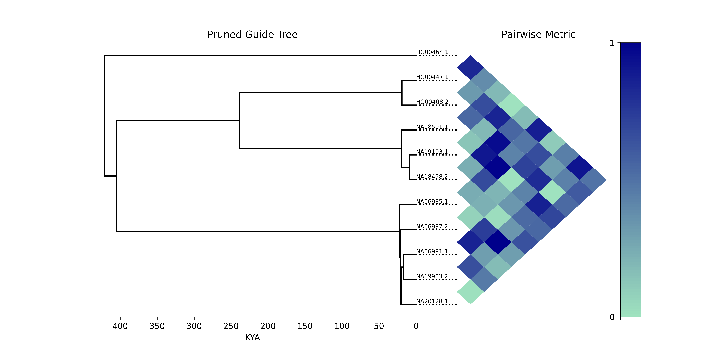

# Centrolign analysis scripts

## 1. pairwise_tree_heatmap.py

Plots a heatmap of any pairwise input values for input samples (for example, alignment distances from centrolign) next to their guide tree.



Usage:
```
python3 pairwise_tree_heatmap.py \
        -t guide_tree.nwk \
        -s list_of_samples.txt \
        -p pairwise_metrics.csv \
        -m metric_label \
        -o output.png
```

`-p` needs to include a header with the values `sample1,sample2,pairwise_metric`

`-m` is a string labelling what metric is being plotted.
