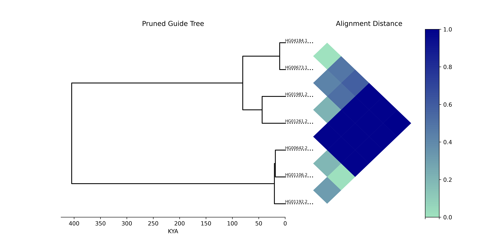
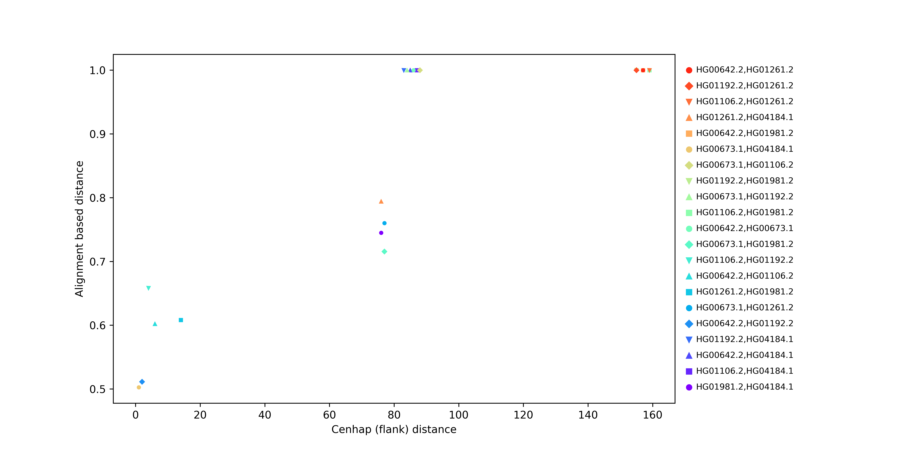

# Centrolign analysis scripts

## 1. pairwise_tree_heatmap.py

Plots a heatmap of any pairwise input values for input samples (for example, alignment distances from centrolign) next to their guide tree.



Usage:
```
python3 pairwise_tree_heatmap.py \
        -t guide_tree.nwk \
        -s list_of_samples.txt \
        -p pairwise_metrics.csv \
        -m metric_label \
        -o output.png
```

`-p` needs to include a header with the values `sample1,sample2,pairwise_metric`

`-m` is a string labelling what metric is being plotted.

A conda environment json file is provided [here](https://github.com/miramastoras/centrolign_analysis/tree/main/conda/tree_heatmap/environment.yml) that will enable this script to run. In order to use the conda environment, download and install minconda from [here](https://docs.anaconda.com/miniconda/install/), then run

```
conda env create -f environment.yml
```

## 2. distance_compare.py

For pairwise samples, plots cenhap distance from SNPs in the flanks versus centrolign alignment based distance


